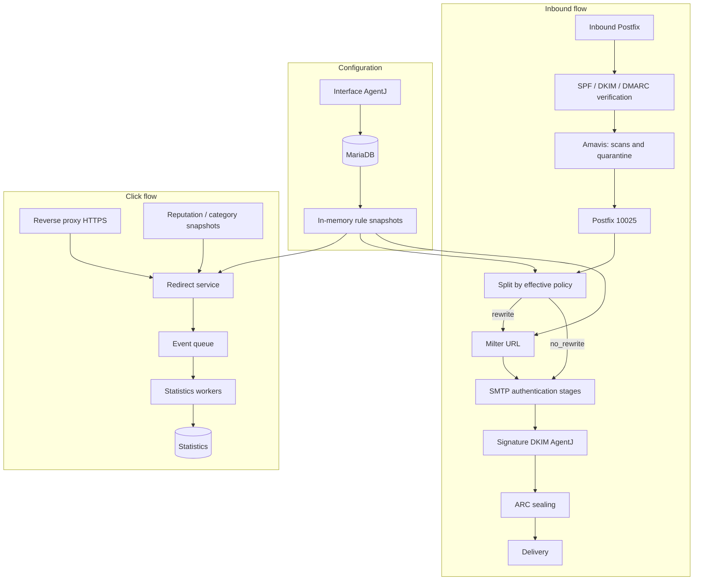
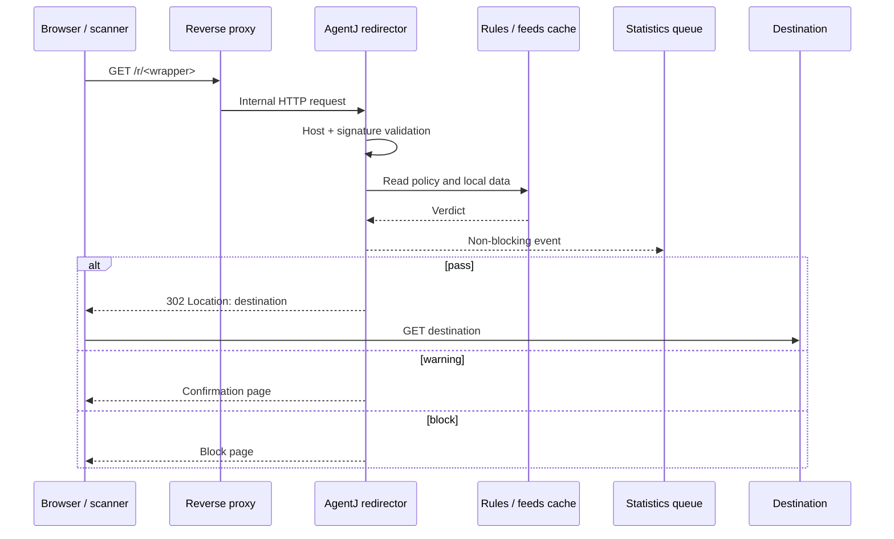
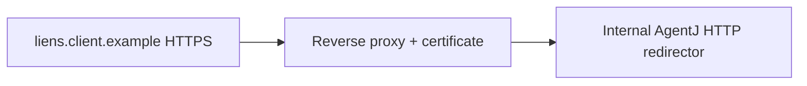
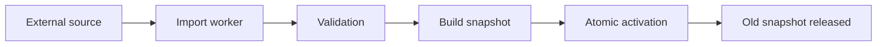
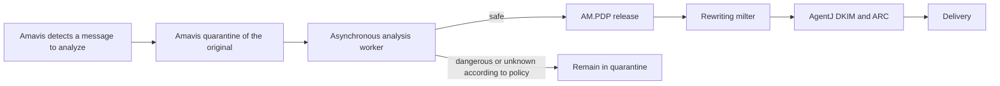

# Architecture — URL rewriting, protection, and tracking in AgentJ

**Status:** target architecture after the Amavis spike
**Date:** August 6, 2026
**Project:** AgentJ — Probesys
**Scope:** inbound email messages processed by AgentJ
**Document objective:** define the target architecture, consolidate decisions made, identify remaining trade-offs, and provide a sufficiently precise basis for creating implementation tasks.

---

## 1. Executive summary

The feature rewrites external URLs in inbound messages so clicks pass through an AgentJ service. This enables:

- collecting access statistics;
- applying `pass`, `warning`, or `block` rules at click time;
- later adding phishing and malware detection from local databases;
- categorizing URLs and domains;
- retaining an up-to-date decision at click time, even if a URL's reputation has changed since the message was received.

The selected architecture is based on the following principles:

1. The Amavis spike is complete. Target rewriting is performed by a **dedicated content milter** after Amavis, on a Postfix path originating from reinjection `10025`.
2. Message authenticity checks, notably DKIM, are performed before the body is modified.
3. An AgentJ DKIM signature and ARC sealing are applied after rewriting. The POC uses OpenDKIM followed by Rspamd ARC as sequential milters on Postfix listener `10026`; DKIM and ARC validity over the delivered bytes is verified independently.
4. The initial scope performs **no reputation check or URL crawling at receipt time**. It extracts and rewrites links, then makes the security decision at click time.
5. Links are represented by a **signed, encoded wrapper** containing the original URL to avoid systematic database writes.
6. SQL fallback storage is planned for overly long wrappers and, optionally, for an administrator mode that uses short identifiers exclusively.
7. Wrappers do not expire to preserve old emails.
8. The redirect service returns HTTP `302` responses.
9. Local URL analysis is performed at click time using the current versions of rules and databases.
10. Policies reuse AgentJ's existing rules architecture: global policy, groups, priorities, and exceptions.
11. The redirect domain is supplied by each organization and served over HTTPS by the reverse proxy already used in front of AgentJ.
12. Previous redirect domains can be retained as aliases so old links do not break.
13. Statistics are published without blocking and consolidated in the background.
14. Signed S/MIME or PGP messages follow a configurable policy; encrypted messages cannot be inspected without gateway decryption.
15. Policies remain applicable per recipient. Postfix splits recipients by effective policy before the milter and produces a MIME variant only when the delivered result differs.
16. The integrated POC uses Go with `go-milter` and is not approved for production until the protocol panic and the MIME and resource limits identified by A1 are fixed.

The target product must not be reduced to a simple tracking redirector. It must provide infrastructure for policy, click-time protection, observability, and evolution toward local threat intelligence.

---

## 2. AgentJ context

AgentJ currently includes:

- Postfix for SMTP flows;
- Amavis for message analysis;
- SpamAssassin and ClamAV;
- OpenDKIM;
- a Symfony 7 / PHP 8.4 application;
- MariaDB ;
- a Symfony Messenger worker;
- HTTP exposure of the application container on port 80, behind an external reverse proxy.

The inbound flow configures Postfix with an Amavis content filter on port `10024`, followed by SMTP reinjection on `10025`. The Amavis `forward_method`, `requeue_method`, and `notify_method` methods all target this service: normal, requeued, and quarantine-released messages therefore converge on `10025`. The current configuration of this port uses `receive_override_options=...no_milters`, which prevents all milters from being replayed on the reinjected message.

Amavis currently enables DKIM verification and signing code. Any signature actually added before a subsequent body rewrite would be invalidated. The architectural invariant is therefore independent of the ultimately selected component: inbound verification precedes transformation and outbound signing follows it.

The POC adds Rspamd as the first inbound Postfix milter. It removes received
`Authentication-Results`, verifies SPF, DKIM, and DMARC using the original
SMTP metadata, then publishes its results under `authserv-id`
`auth.agentj.test`. Amavis retains this result, including on `allow`
paths, and Rspamd ARC includes it in `ARC-Authentication-Results` after the
final DKIM signature. Inbound ARC validation remains to be addressed.

### 2.1. Selected processing chain


Service `10025` must not blindly re-enable all milters. Postfix routing separates recipients by policy result and reinjects each homogeneous group on `10026`. Postfix then invokes the URL milter, OpenDKIM-final, and Rspamd ARC in that order, applying the modifications from each filter before the next. The POC cryptographic test confirms that DKIM covers the replaced body and that `ARC-Message-Signature` covers the added DKIM header. This sequence therefore requires no additional SMTP transaction between the three milters.

AgentJ DKIM and ARC have two different roles. DKIM attests to the integrity of the transformed version. The ARC sealer records in `ARC-Authentication-Results` the results calculated before transformation by trusted AgentJ components, then protects the ARC chain. An AgentJ DKIM signature using a gateway domain does not necessarily restore DMARC alignment with the author domain; ARC's effect depends on its validation and the recipient's trust in AgentJ.

### 2.2. Allocation of responsibilities

**Amavis :**

- analyzes the message without rewriting URLs;
- applies filtering decisions per recipient;
- retains a shared original copy in quarantine;
- handles releases, currently one recipient at a time;
- passes deliverable messages to `10025` without a final AgentJ signature.

**Postfix and policy resolution:**

- resolve the effective URL policy per recipient;
- group recipients that produce exactly the same body;
- create separate transactions for `rewrite` and `no_rewrite`;
- avoid a per-user copy as long as no individual tracking data is encoded in the wrapper.

**Rewriting milter:**

- receives only a transaction with a homogeneous policy;
- handles the milter protocol, spool, MIME parsing, and resource limits;
- executes transformations through a daemon-independent contract;
- applies the configured failure policy: pass-through without rewriting, temporary error, or possible Postfix `hold`.

**URL transformation:**

- selects and rewrites the relevant parts;
- generates and signs URL wrappers;
- detects existing AgentJ wrappers;
- remains a functional module connected to the generic engine.

**Final authentication stage:**

- receives the message after every body modification;
- adds a DKIM signature with an AgentJ-controlled identity;
- builds `ARC-Authentication-Results` only from initial results produced by trusted AgentJ components;
- adds the ARC set after the AgentJ DKIM signature;
- does not rerun inbound DKIM verification as if the transformed message were the original.

### 2.3. Amavis and milter trade-off

Rewriting in Amavis was evaluated first to determine whether it could reuse its MIME processing and avoid an additional service. The POC showed that this benefit was not realized: the experimental module rereads the raw message and runs its own `MIME::Parser` after the parsing already performed by Amavis.

| Criterion | Milter after Amavis | POC rewriting in Amavis |
|---|---|---|
| Position | Supported Postfix boundary after scans | Three insertions into Amavis internals |
| Observed MIME parsing | Dedicated parsing to design | A second dedicated parsing already present in the POC |
| Isolation | Independently scalable and restartable service | CPU, memory, and errors in critical Amavis workers |
| Maintenance | Stable SMTP/milter contract and standalone tests | Dependency on internal objects, dispatching, and grouping |
| Quarantine | Original retained before the milter | Original retained before the experimental hook |
| Releases | Common path through `10025` | Coverage obtained only by patching `mail_dispatch` |
| Divergent policies | Mandatory Postfix split before the milter | Split demonstrated by diverting `mail_body_mangle` |
| Final authentication | Post-rewrite transactions or integrated component guaranteeing DKIM then ARC order | Amavis did not produce a valid final signature in the POC |
| Load | To be measured; independent service but extra SMTP hops | Not measured; several complete in-memory representations |

The milter is preferred because two blocking criteria of the Amavis POC failed: no valid final signature was produced, and the transformation depended on several unsupported internals. Adding only DKIM and ARC after Amavis would fix the first issue, but not the coupling or upgrade risk. Amavis remains responsible for scans and quarantine; the milter becomes responsible for transformation.

The existing `senderverifmilter` component is not a content-milter foundation. Despite its name, it implements a Postfix policy service that reads a small text request and does not speak the body milter protocol.

### 2.4. Amavis POC results

The POC is retained on local branch `poc/chantier-0-amavis`, at commit `5516586711cd3c380f0fea0a987c6c4c9c3c740b` at the time of this update. Its detailed report is available in `docs/chantier-0-amavis-poc.md`. It remains disabled by default and must not be enabled in production. The branch must be published or merged before serving as an external reference.

Established results:

- inbound DKIM verification completed before transformation;
- strictly identical no-op for a message without a URL;
- POC MIME corpus validated by 27 assertions;
- original retained in quarantine before rewriting;
- two successive releases each rewritten only once;
- normal transaction with divergent policies split into an original variant and a rewritten variant;
- forced error handled fail-open without making the container unhealthy;
- inbound DKIM signature invalidated, as expected, by body modification;
- no new valid DKIM signature on the transformed body;
- no ARC sealing;
- integration dependent on `before_send`, `mail_body_mangle`, `prepare_modified_mail`, and `mail_dispatch`.

The POC did not measure load. Its engine reads the complete message, parses and decodes bodies in memory, then creates a second complete serialization. Memory peaks can therefore be several times the message size, especially with large encoded attachments. This engine remains a behavioral reference and test corpus, not a capacity-validated production implementation.

### 2.5. Milter frameworks and language

The initial research confirmed the existence of reusable open-source frameworks and libraries. The inventory below retains the initial evaluation; the integrated POC subsequently selected Go with `go-milter`, subject to the A1 blocking fixes before any production use.

| Solution | Language | Provided scope | Evaluation for AgentJ |
|---|---|---|---|
| MIMEDefang | C and Perl | Milter daemon, spool, MIME parsing and reconstruction, worker pool, resource limits, modification API | Comprehensive candidate to evaluate; version 3.7.1 released July 14, 2026, and active project |
| pymilter | C and Python | `libmilter` bindings, callbacks, and MIME helpers | Usable framework, but spool, supervision, and capacity model remain to be built |
| go-milter | Go | Milter protocol client and server, message modification | Active, lightweight library, but MIME engine, spool, and worker management to develop |
| Rspamd proxy worker | C and Lua | Robust milter, scanning, load distribution, actions, DKIM/ARC, and `lua_mime` reconstruction API | The MIME fidelity, arbitrary part replacement, and spool model needed by AgentJ remain to be demonstrated |
| libmilter | C | Sendmail-provided filter-side C API; Postfix implements the compatible protocol | Too low-level for this need except as a framework dependency; Postfix differences to verify |
| PHP CLI development | PHP | No mature content framework identified | Technically possible, but protocol, daemon, concurrency, and spool would need to be maintained in AgentJ |

MIMEDefang has several load-related advantages:

- `MIME::Parser` uses `output_to_core(0)` and `tmp_to_core(0)` by default;
- parts are extracted into a temporary working directory;
- `MIME::Parser` can extract and decode entities to the spool, but the AgentJ filter must load only eligible `text/plain` and `text/html` leaves into memory;
- the rebuilt message is written to a `NEWBODY` file;
- the multiplexor reuses a Perl worker pool;
- the number of workers, processing time, RSS, and virtual memory can be limited;
- workers can be recycled after a number of messages and adjusted to load;
- official Docker images for Postfix exist.

The POC logic must not be called as-is through `rewrite_message($raw)`, because it would reload the entire message. It must be adapted to MIMEDefang callbacks to directly modify only the files for eligible MIME leaves, then request reconstruction.

MIMEDefang does not automatically resolve divergent policies. It processes one body per transaction, and its resubmission functions by recipient or domain do not directly map to AgentJ grouping by effective policy. The Postfix split before the milter therefore remains the target to demonstrate.

MIMEDefang exposes DKIM and ARC functions, but its 3.7.1 implementation signs the `INPUTMSG` file. In a pass that produces a `NEWBODY`, it would therefore calculate signatures on the original input rather than the rebuilt body. A post-rewrite signing stage separate from this pass remains mandatory until a test or upstream change guarantees otherwise.

The functional integration provisionally selects Go with `go-milter`. The production decision remains contingent on fixing its framing panic and validating MIME fidelity, spool, concurrency, and resource limits. MIMEDefang is not selected by default; adopting it would additionally require validating compatibility between its GPL-2.0, AgentJ's AGPL-3.0, the filter loaded by the framework, and container distribution.

---

## 3. Objectives and non-objectives

### 3.1. Objectives

- Rewrite HTTP and HTTPS links in inbound messages.
- Preserve deliverability and authentication-pipeline integrity.
- Prevent the AgentJ domain from becoming an open redirect.
- Support rewriting and click policies by organization, group, and priority.
- Provide a low-latency redirector.
- Apply a click-time decision using up-to-date local data.
- Collect technical, functional, and security statistics.
- Handle forwarded messages and existing AgentJ wrappers.
- Support multiple redirect domains per organization.
- Preserve old-link operation when a domain or key changes.
- Prepare integration of public reputation and categorization databases.

### 3.2. Immediate non-objectives

These items are planned in the architecture but are not part of the first implementation scope:

- extraction of URLs in QR codes;
- analysis of URLs in attachments;
- complete dynamic analysis of pages;
- execution of remote JavaScript;
- browser sandboxing;
- systematic network resolution of every redirect chain;
- URL reputation or categorization lookup at receipt time;
- active analysis of destinations before delivery;
- centralized decryption of S/MIME or PGP messages;
- replacement of an enterprise web proxy;
- general filtering of browsing outside email.

---

## 4. Terminology

| Term | Definition |
|---|---|
| Organization | Customer or logical space to which users, rules, domains, and statistics belong. Equivalent to the technical term “tenant”. |
| Received URL | Exact string present in the message before rewriting. |
| Destination URL | URL to which AgentJ must ultimately redirect. |
| Normalized URL | Representation used for comparisons, lookups, and statistics. It never replaces the exact destination URL. |
| Wrapper | AgentJ URL encoding or referring to the destination and carrying a signature. |
| Referenced link | Short wrapper whose identifier points to an SQL row. |
| Rewrite policy | Decision made during mail processing: `rewrite` or `no_rewrite`. |
| Click policy | Click-time decision: `pass`, `warning`, or `block`. |
| Feed | External reputation or categorization database synchronized locally. |
| Scanner | Automated system that visits message links to assess their security. |

---

## 5. Decision register

| Topic | Decision |
|---|---|
| Rewrite location | Dedicated content milter after Amavis, on a Postfix path originating from `10025`. The POC Amavis transformation patch is not productionized. |
| DKIM | Verify before modification; retain the initial result; use OpenDKIM-final to apply an AgentJ signature to the final body, after the URL milter on `10026`. |
| ARC | Build `ARC-Authentication-Results` from trusted results, then seal the chain after transformation and AgentJ DKIM. ARC does not guarantee acceptance by all recipients. |
| Multiple recipients | Compute the policy per recipient, group identical results, and split transactions before the milter when a body variant is required. |
| Rewriter failure | Policy-configurable behavior: pass through without rewriting, temporary error, or possible Postfix `hold`. `hold` does not automatically enter the Amavis SQL quarantine. |
| Milter framework | Integrated POC with `go-milter`; productionization contingent on fixing the framing panic and A1 hardening. |
| Milter language | Go for the integrated POC; production decision contingent on fixes and A1 load testing. |
| URL check at receipt | None in the initial scope: no feed lookup, network resolution, or crawling. |
| URL analysis before delivery | Optional asynchronous evolution based on Amavis quarantine. |
| Initial protocols | `http` and `https`. |
| HTML | Choice between replacing only `href` and replacing `href` + visible URL. |
| Plain text | Rewrite URLs detected in `text/plain`. |
| Other media | QR codes and attachments planned as evolutions. |
| Rules | Reuse AgentJ rules behavior: global, groups, priorities, exceptions. |
| Rules at receipt | `rewrite` / `no_rewrite`. |
| Click actions | `pass` / `warning` / `block`. |
| Primary wrapper | Signed, encoded payload without systematic SQL writes. |
| Wrapper encryption | Not mandatory. Signing is mandatory; encryption remains a future option. |
| URL too long | SQL fallback storage and short random identifier. |
| Primary storage | AgentJ MariaDB/SQL. Abstraction planned for later extraction. |
| Expiration | No functional expiration of wrappers. |
| Key rotation | Key identifier in the wrapper; old keys retained for verification. |
| Redirection | Wrappers accessible with `GET` and HTTP `302`; confirm a warning with `POST`. |
| Analysis | At click time, using up-to-date local data. |
| Remote analysis | Not systematic in the normal path. |
| Categorization | Initially for statistics; later use in rules is possible. |
| Allowlist / blocklist | Exact URL, domain, and subdomains through AgentJ rules. |
| Already protected links | Unwrapping architecture planned; implementation not prioritized. |
| Signed messages | Configurable policy. |
| Encrypted messages | Not inspectable; configurable pass-through, quarantine, or block policy. |
| Redirect domain | Domain or subdomain provided by the customer. |
| TLS | Terminated by the external reverse proxy, like the current AgentJ interface. |
| Domain change | Previous domain may be retained as an alias. |
| Warning/block pages | Controlled customization, no free HTML upload. |
| Statistics | Non-blocking events, asynchronous processing. |
| Forwarded mail | Recognize AgentJ wrappers, avoid stacking, retain minimal origin information. |

---

## 6. Target functional architecture



### 6.1. Components

#### Rewriting engine

Generic infrastructure responsible for message transformation:

- reading the policy context;
- MIME parsing;
- spool and resource limits;
- execution contract for pluggable transformations;
- message replacement through the milter protocol;
- processing metrics.

The URL transformation module is responsible for:

- URL extraction and validation;
- wrapper generation;
- HTML and text rewriting;
- signed-message handling;
- existing AgentJ wrapper detection.

Its target integration is a content milter after Amavis. The selected framework must provide or enable clean construction of the milter protocol, MIME spool, and worker management. The Amavis POC Perl module and its corpus remain a behavioral reference, but its function that loads the full message must not be reused as-is.

#### Redirect service

Responsible for the click path:

- requested-domain validation;
- signature validation;
- destination resolution;
- current-policy lookup;
- local-database lookup;
- `pass`, `warning`, or `block` decision;
- statistics-event publication;
- `302` response or decision page.

A dedicated service or container is recommended to isolate click load from the Symfony interface. The implementation can share libraries with the application but must not unnecessarily initialize the entire administration interface for every request.

#### Feed manager

Responsible for:

- downloading databases;
- verifying their integrity;
- building indexes;
- atomically publishing a new snapshot;
- retaining the previous snapshot on failure;
- exposing the version and date of each source.

#### Workers

The existing Symfony Messenger worker can be reused or extended to:

- ingest click events;
- aggregate counters;
- classify scanners;
- import feeds;
- later resolve redirectors;
- send alerts and webhooks.

---

## 7. Policies and rules

### 7.1. Two independent levels

Configuration must distinguish:

#### Rewrite policy at receipt time

- `rewrite`
- `no_rewrite`

#### Click policy

- `pass`
- `warning`
- `block`

An allowlist therefore does not always mean “do not rewrite”.

This policy decides only whether URLs are wrapped by AgentJ. It makes no URL security verdict at receipt time within the initial scope. Categories, reputation, and feeds are consulted at click time.

Examples:

| Case | Rewrite at receipt time | Click |
|---|---|---|
| Internal domain without tracking | `no_rewrite` | Not applicable |
| Internal domain with statistics | `rewrite` | `pass` |
| Unknown domain | `rewrite` | Based on reputation |
| Prohibited domain | `rewrite` | `block` |
| Sensitive single-use link | `no_rewrite` or `rewrite` | `warning` |

### 7.2. Scopes

Rules must reuse the scopes already used in AgentJ, but applicable data differs by decision time.

At receipt time, the rewrite policy can use:

- global policy;
- organization;
- group;
- user, if the current model supports it;
- sender or sender domain;
- recipient;
- exact URL;
- domain;
- subdomains;
- path;
- signed or encrypted message type.

At click time, the decision can additionally use:

- category;
- reputation;
- feed version and age;
- signals calculated since receipt.

Category and reputation are not consulted by the rewriting engine in the initial scope.

### 7.3. Priorities

The engine must retain deterministic semantics. It is preferable to reuse AgentJ's existing priority rules exactly rather than introduce a second mental model.

URL rules must nevertheless allow explicitly expressing:

```text
example.com
*.example.com
https://example.com/path
https://example.com/path/*
```

A simple suffix test is prohibited because `falseexample.com` must not match `example.com`.

### 7.4. Rule loading and cache

The SQL database is the source of truth but must not be queried for every URL.

Recommended architecture:

1. rules are loaded from SQL;
2. they are compiled into an immutable snapshot;
3. the snapshot is retained in memory by the rewriting engine and redirector;
4. a change increments a version or publishes an invalidation event;
5. processes reload the snapshot;
6. policy context is resolved by recipient or recipient group;
7. exact rewrite rules are then evaluated for each URL, without feeds or reputation in the initial scope.

Possible structures:

- hash maps for exact matches;
- reversed-domain trie for subdomains;
- prefix index for paths;
- ordered lists for complex rules.

### 7.5. Messages with multiple recipients

A single SMTP message can target multiple recipients with different policies. AgentJ and Amavis already retain one copy of the message and apply a delivery or quarantine decision per recipient: these decisions change the envelope and state, not the MIME body.

Rewriting is different. An SMTP transaction carries only one `DATA` body, and a milter can replace it only once for all its recipients. If Alice must receive AgentJ links and Bob original links, two transactions are required.

Selected decision:

- compute the effective policy per recipient;
- group recipients with exactly the same rewriting context;
- split these groups through Postfix routing before the milter;
- produce a MIME variant only for each distinct body result;
- produce a per-recipient copy only when the wrapper contains an individual identifier.

This model is consistent with documented market practices. Microsoft Safe Links applies policies to users, groups, and domains and states that wrapping is performed per message recipient. Cisco Secure Email documents *splintering* a message into separate messages by policy before its content filters.

Consequence:

- aggregated statistics allow copies to be shared;
- named tracking generally requires a different wrapper per recipient;
- attribution to the original recipient remains imperfect after mail forwarding.
- the milter POC must demonstrate splitting without modifying Amavis's current individual decisions;
- benchmarks must separately measure one homogeneous group, two groups, and one variant per recipient.

---

## 8. MIME processing and rewriting

### 8.1. Initial types

The engine processes:

- `text/html` ;
- `text/plain` ;
- `multipart/alternative` structures;
- usual nested MIME structures.

It initially does not process:

- RTF/TNEF ;
- URLs in images;
- QR codes;
- Office documents or PDFs;
- HTML attachments, except by later specific decision.

### 8.2. HTML

Two modes must be available:

#### `href_only`

```html
<a href="https://links.client.example/r/...">https://example.org</a>
```

Advantages:

- unchanged presentation;
- low risk of breaking layout;
- behavior close to that currently used by several competitors.

Disadvantage:

- the displayed URL differs from the URL actually opened;
- some users may consider this difference suspicious.

#### `href_and_visible_url`

When the visible text itself is the original URL, it is replaced by the wrapper.

```html
<a href="https://links.client.example/r/...">
  https://links.client.example/r/...
</a>
```

The engine must not arbitrarily replace text such as “Click here”.

### 8.3. HTML parsing

Transformation must use a tolerant HTML parser, not global regular expressions.

A length difference does not break HTML when the document is parsed and serialized. It becomes dangerous only if the implementation directly modifies offsets in a buffer after changing its length.

Items to test:

- invalid HTML accepted by mail clients;
- attributes with single quotes, double quotes, or no quotes;
- HTML entities;
- encoded URLs;
- quoted-printable and base64 content;
- `<base>` tags;
- inline CSS containing `url(...)`, outside the initial scope;
- links in comments or scripts, to ignore;
- standalone `#fragment` anchors;
- `mailto:`, `tel:`, `cid:`, and `data:`, not to rewrite.

### 8.4. Plain text

Detected HTTP/HTTPS URLs are replaced in the `text/plain` part.

The following must be preserved:

- possible flowed format;
- MIME line breaks;
- encoding;
- immediately adjacent punctuation;
- angle brackets used to delimit a URL;
- line folding.

### 8.5. Message size

Rewriting increases body size. The engine must:

- calculate the final size;
- comply with the AgentJ SMTP limit;
- avoid disproportionate growth;
- log the number of links and size increase;
- define a policy if the message exceeds the limit after transformation.

---

## 9. Wrapper format

### 9.1. Objectives

The wrapper must:

- make the URL recoverable without SQL storage in the normal case;
- guarantee that the link was generated by AgentJ;
- prevent destination modification;
- support key rotation;
- survive forwarding and common mail-client handling;
- not expire;
- allow a versioned format.

### 9.2. Recommended format

Conceptual example:

```text
https://links.client.example/r/v1.k3.<payload-base64url>.<signature-base64url>
```

The payload contains at least:

```json
{
  "organization_id": "org-id",
  "url": "https://destination.example/path",
  "created_at": 1785931200
}
```

Optional fields:

```json
{
  "message_tracking_id": "pseudonymous-id",
  "recipient_tracking_id": "pseudonymous-id",
  "origin": "direct|forwarded_agentj|wrapped_external",
  "origin_domain": "old-links.example",
  "rewrite_depth": 1
}
```

### 9.3. Signature

The signature is mandatory. Example:

```text
HMAC-SHA-256(secret_key, version || key_id || payload_bytes)
```

It protects:

- the destination;
- the organization;
- the tracking context;
- the version;
- metadata.

An unsigned `url=...` parameter would create an open redirect exploitable for phishing campaigns.

The experimental `https://links.agentj.invalid/poc?url=...` format used on branch `poc/chantier-0-amavis` is deliberately unsigned. It is rejected as a production format and must never be exposed on a public domain.

### 9.4. Encryption

Encryption is not necessary to prevent redirector abuse. It addresses a different need: hiding the destination and its parameters.

The product must retain the option to later add an encrypted and authenticated wrapper, but the default format can remain transparent and signed.

Advantages of a transparent format:

- simpler decoding and diagnosis;
- better interoperability with third-party security products;
- destination potentially visible to a scanner.

Disadvantages:

- sensitive parameters visible in the mail source;
- risk of unintentional logging;
- a third-party tool may bypass the redirector by decoding the destination.

### 9.5. No expiration

Wrappers do not functionally expire because users must be able to open old emails.

Consequences:

- historical keys must be retained;
- every wrapper carries a `key_id`;
- old keys become “verify only”;
- key backup is as critical as data backup;
- a key-compromise procedure must exist, even if it can invalidate links.

### 9.6. Destination validation

After decoding:

- only `http` and `https` are accepted;
- the URL must be syntactically valid;
- control characters are rejected;
- relative or ambiguous schemes are rejected;
- the service must not interpret a second URL provided in the HTTP request;
- the wrapper Host must match a registered redirect domain.

---

## 10. SQL fallback storage

### 10.1. Use cases

Fallback storage is used when:

- the wrapper exceeds the selected maximum length;
- the destination is exceptionally long;
- individual revocation is required;
- an administrator option forces referenced links;
- a future feature requires changing the destination after receipt.

### 10.2. Referenced wrapper

```text
https://links.client.example/i/<random-identifier>
```

The identifier must be random and non-predictable, for example, 128 bits or more.

A public URL hash alone must not be used:

- common URLs can be guessed;
- two identical links become correlatable;
- a hash alone does not include the organization concept;
- it does not necessarily protect against enumeration.

### 10.3. Proposed schema

```text
url_redirect_reference
- id
- organization_id
- public_token
- original_url_encrypted_or_plain
- normalized_url_hmac
- created_at
- revoked_at nullable
- metadata_json nullable
```

Indexes:

- unique on `public_token`;
- index on `organization_id`;
- optional index on `normalized_url_hmac` for deduplication.

### 10.4. Deduplication

Deduplication can avoid storing the same URL multiple times for an organization:

```text
HMAC(deduplication_key, organization_id || normalized_url)
```

Deduplication must remain compatible with statistical needs. Two different messages can share the same destination while requiring distinct tracking contexts.

### 10.5. “All links referenced” mode

This mode can be offered as an administrator option, but must not be the default behavior.

Advantages:

- short links;
- simple revocation;
- modifiable destination;
- centralized audit;
- less constraining cryptographic rotation for the payload.

Disadvantages:

- SQL write for every URL or unique destination;
- SQL dependency for every click;
- permanent growth without expiration;
- larger backups;
- risk of contention under heavy load;
- old links unusable if the database is lost.

The mode must therefore be presented as a trade-off of control against performance and autonomy.

### 10.6. Switch threshold

The threshold must not be chosen arbitrarily. It must be determined from:

- a real corpus of AgentJ messages;
- observed mail-client limits;
- additional transformations by Microsoft, Proofpoint, or Mimecast;
- the customer-domain length;
- logging and reverse-proxy constraints.

The test must measure at least the thresholds of 1,024, 2,048, 4,096, and 8,192 characters.

---

## 11. Redirect service

### 11.1. Nominal path



### 11.2. Why `302`

Opening a wrapper uses `GET`. Only explicit confirmation of a warning subsequently uses a `POST` internal to the redirector.

`302` is suitable for standard navigation and avoids preserving a potential request method and body, unlike `307`.

### 11.3. `pass` response

The response must be minimal:

```http
HTTP/1.1 302 Found
Location: https://destination.example/
Cache-Control: no-store
Referrer-Policy: no-referrer
X-Robots-Tag: noindex, nofollow
```

No intermediate page is displayed in the normal case.

### 11.4. `warning` response

The page displays:

- the destination domain;
- the reason for the warning;
- the relevant generic rule or category;
- a Cancel button;
- a Confirm button.

The confirmation button must use a `POST` request with a short confirmation token bound to the wrapper. Simply loading the page must not trigger the destination.

This limits risks associated with scanners and distinguishes:

- wrapper visit;
- warning display;
- explicit confirmation.

### 11.5. `block` response

The page contains no automatic redirect.

It can display:

- the domain or URL according to policy;
- the reason;
- the event identifier;
- the support contact;
- an unblock-request button;
- optionally, an administrator action outside the public flow.

### 11.6. Customization

Allowed customization:

- logo;
- colors;
- organization name;
- text;
- translations;
- support contact details;
- display or concealment of the destination;
- review-request button.

Free upload of HTML or JavaScript is not allowed to avoid:

- XSS;
- credential theft;
- fake login forms;
- loading third-party scripts;
- damage to the domain's reputation.

### 11.7. Failure behavior

| Failure | Recommended behavior |
|---|---|
| Statistics publication unavailable | Do not block the redirect; local buffer or controlled loss of metrics. |
| Feed not updated | Use the last valid snapshot and report its staleness. |
| SQL database unavailable | Stateless wrappers continue; referenced wrappers display a controlled error. |
| Rules snapshot unavailable at startup | Do not start the redirector or use an explicitly configured policy. |
| Unknown analysis | Apply the organization's `unknown` policy. |
| Reverse proxy unavailable | Links are unavailable; high availability is required. |

---

## 12. Redirect domains and HTTPS

### 12.1. Selected model

Each organization provides a domain or subdomain, for example:

```text
liens.client.example
```

The customer configures DNS to point to the AgentJ reverse proxy:

```dns
liens.client.example. CNAME agentj-gateway.example.
```

Configuration with an `A` or `AAAA` record remains possible depending on the infrastructure.

### 12.2. TLS

AgentJ does not currently manage HTTPS for its interface automatically. The application container exposes HTTP and TLS is terminated by an external reverse proxy.

The same model is selected for the redirector:



Certificate generation and renewal remain managed by the reverse proxy, for example through:

- Let’s Encrypt / ACME;
- a certificate supplied by the customer;
- internal PKI.

### 12.3. AgentJ configuration

Proposed entity:

```text
redirect_domain
- id
- organization_id
- hostname
- status: primary | alias | disabled
- created_at
- disabled_at nullable
- last_dns_check_at nullable
- last_tls_check_at nullable
```

Constraints:

- a hostname can belong to only one organization;
- only one active primary domain per organization;
- multiple aliases are possible;
- unknown Hosts are rejected;
- case and the final DNS dot are normalized.

### 12.4. Domain change

When changing a domain:

- new wrappers use the new primary domain;
- old domains remain configurable as aliases;
- old wrappers remain valid;
- the token must not be cryptographically bound to the hostname;
- the administrator is warned that DNS or TLS removal breaks old links.

### 12.5. Customer offboarding

The following must be documented contractually and technically:

- who retains the domain;
- how long the reverse proxy continues serving it;
- what happens to old keys;
- how to export SQL references;
- whether a permanent redirect to a new instance is possible;
- how to prevent an abandoned domain from being taken over by a third party.

---

## 13. Click-time analysis

### 13.1. Principle

Within the initial scope, no URL security classification is calculated at receipt time, even when feeds are available locally. The rewriting engine extracts and wraps URLs without querying feeds or making network access to destinations.

At click time:

1. retrieve the exact URL;
2. produce a normalized representation;
3. attempt to unwrap known wrappers;
4. compare the exact URL with lists;
5. compare the domain and subdomains;
6. apply categorization;
7. apply reputation;
8. apply local rules;
9. make the decision.

This strategy always uses the currently loaded databases.

### 13.2. Exact URL and normalized URL

Two values must be retained in memory:

- `original_url`: used for redirection;
- `normalized_url`: used for comparison.

Normalization must be versioned. It can include:

- scheme and hostname normalization;
- IDNA conversion;
- removal of the default port;
- controlled normalization of percent-encoded characters;
- registrable-domain extraction with the Public Suffix List;
- retention of the path and query for exact matches.

Query parameters must not be sorted or removed before redirection. Such a modification could break a remote signature or token.

### 13.3. Match levels

- exact URL;
- URL without fragment;
- exact hostname;
- registrable domain;
- subdomain wildcard;
- exact path;
- path prefix;
- category;
- reputation;
- known redirector or URL shortener.

### 13.4. Proposed local feeds

#### UT Capitole blacklists

Primary use:

- categorization;
- social networks;
- URL shorteners;
- redirectors;
- webmail;
- file hosting;
- other categories.

This source must not be considered a security authority on its own.

#### PhishTank

- verified phishing URLs;
- downloadable database;
- hourly updates;
- suitable for high-volume local lookups.

#### URLhaus

- URLs used to distribute malware;
- complete and recent dumps;
- frequent updates;
- fair-use terms to verify for commercial use.

#### OpenPhish

- free community feed;
- slower frequency and limited data;
- more complete commercial offerings.

#### MISP

- optional connector to the customer's instance;
- aggregation of internal or sector-specific threat intelligence;
- future integration suitable for equipped organizations.

#### Public Suffix List

- correct registrable-domain calculation;
- indispensable for rules on subdomains and complex public domains.

### 13.5. Feed updates



Rules:

- never replace a valid snapshot with an incomplete import;
- check the format, date, and minimum size;
- retain the previous version;
- expose the feed age;
- alert on repeated failure;
- load indexes into memory or through a suitable mmap format;
- do not call remote APIs in the normal click path.

### 13.6. Reputation and category

These concepts remain separate.

Example:

```text
Category: social_networks
Reputation: neutral
Action: pass
```

Categorization initially serves statistics. The architecture subsequently allows its use in rules without turning AgentJ into a general-purpose web proxy.

---

## 14. Already wrapped or shortened URLs

### 14.1. AgentJ wrappers

The redirector and rewriting engine must recognize AgentJ wrappers through:

- the known domain;
- the versioned format;
- the signature.

When a message containing an AgentJ wrapper is reprocessed:

- same organization and compatible context: the link can remain unchanged;
- organization or policy change: decode, then generate a new wrapper;
- invalid wrapper: treat it as an unknown external URL;
- do not stack multiple AgentJ wrappers.

Possible minimal metadata:

```json
{
  "origin": "forwarded_agentj",
  "origin_domain": "liens.old-client.example",
  "rewrite_depth": 1
}
```

No identity of the original recipient must be passed to the new organization.

### 14.2. Competing wrappers

Provide an interface:

```text
UrlUnwrapper
- supports(url)
- unwrap(url)
- provider()
- confidence()
```

Future implementations:

- Microsoft Safe Links;
- Proofpoint URL Defense;
- Mimecast URL Protect;
- known marketing wrappers;
- generic redirectors with an explicit parameter.

Local decoding is preferred when it is deterministic.

### 14.3. Network resolution

If the destination is not encoded in the wrapper, network resolution may be necessary. It must be performed by an isolated service, not directly by the main redirector.

Protections:

- HTTP/HTTPS only;
- blocking private and reserved IPs;
- new DNS validation after every redirect;
- DNS rebinding protection;
- maximum number of redirects;
- strict timeout;
- limited response size;
- no cookies or authentication;
- no JavaScript;
- controlled logging;
- analysis caching and deduplication.

This capability is not a priority in the first implementation, but data models must be able to retain a redirect chain.

---

## 15. Single-use links and scanners

### 15.1. Problem

Scanners can automatically follow a `302` and consume:

- a password reset;
- a magic link;
- an invitation;
- a single-use download link;
- an account confirmation.

No exhaustive, reliable list of these links exists.

### 15.2. Selected strategy

Management is handled through AgentJ rules:

- `no_rewrite` for incompatible domains or paths;
- `warning` to require explicit confirmation;
- gradual addition of rules when incompatibilities are identified;
- rule templates provided by default for common cases, without claiming exhaustiveness.

Heuristic detection of parameters such as `token`, `code`, or `invite` can produce a signal but must not decide on its own.

### 15.3. Automatic-visit classification

Statistics can classify:

- probable human;
- probable scanner;
- undetermined.

Possible signals:

- visiting all links in an email within a few seconds;
- very high frequency;
- known IP ranges;
- User-Agent;
- click before delivery or immediately afterward;
- no confirmation on a warning page;
- identical repetitions.

This classification remains probabilistic and must not be presented as a certainty.

---

## 16. Signed and encrypted messages

### 16.1. DKIM

DKIM protects integrity during transport. Verification must take place before transformation.

Results calculated before transformation by trusted authentication components are passed to the sealer. It creates the instance's `ARC-Authentication-Results`; `Authentication-Results` headers received from an untrusted source are removed or neutralized in accordance with the trust boundary defined by RFC 8601. The `ARC-Seal` then protects the ARC set, without guaranteeing the accuracy of a poorly calculated initial verdict.

Rewriting a URL normally changes the body hash and invalidates the original DKIM signature. This behavior is identical with an Amavis hook and with a milter. The following must be distinguished:

- the `dkim=pass` result calculated on the received message;
- the original DKIM signature, retained for audit but generally invalid after rewriting;
- the AgentJ signature, calculated on the transformed version and attesting to passage through the gateway, without necessarily restoring DMARC alignment for the author domain.

The historical configuration enables signing code in Amavis, but no key is selected for this non-`originating` inbound flow. The POC overlay now connects `10025` to the router, then to listener `10026`, where OpenDKIM-final covers the transformed message before ARC sealing by Rspamd. Without this opt-in overlay, historical behavior remains unchanged.

The target order is:

```text
inbound DKIM verification
→ Amavis scans and policies
→ split by effective policy
→ milter rewriting for applicable groups
→ AgentJ DKIM signature on the final body
→ ARC-Authentication-Results built from initial trusted results
→ ARC sealing
→ delivery
```

The historical OpenDKIM instance must not be blindly replayed on `10025`. The POC uses a dedicated signing-only instance with `d=agentj.test`, `s=final`, and `i=final-signer@agentj.test`, followed by Rspamd ARC with `d=arc.agentj.test` and `s=arc-202608`. These fixed test identities are controlled by AgentJ and never depend on the external `From:`. Their per-organization variation, production storage, and rotation remain to be defined.

Administration must allow DKIM and ARC identities to be tested separately. The check resolves the TXT `<selector>._domainkey.<domain>` through the resolver used by AgentJ, compares the published key with the active public key, and explicitly reports absence, mismatch, multiple invalid responses, or a timeout. It displays the tested domain and selector without exposing the private key. In production, this check targets public DNS; the POC uses internal DNS reserved for testing.

A valid AgentJ DKIM signature that is not aligned with the `From:` domain is not necessarily sufficient to pass DMARC. After rewriting, the recipient may observe an invalid original signature, unaligned SPF, and a valid but unaligned AgentJ signature. ARC allows AgentJ to cryptographically record trusted SPF, DKIM, and DMARC results obtained before modification; it attests to the gateway's assertion, not to the inherent correctness of these calculations.

ARC is not an absolute deliverability guarantee: the final server must support ARC and trust the AgentJ chain. Managed or contractually known destinations must be configured for that trust. For relaying to arbitrary public servers, the risk of DMARC rejection must be measured using messages from, in particular, domains with `p=reject`.

### 16.2. Signed S/MIME or PGP

The content is readable, but any body modification invalidates the end-to-end signature.

Configurable actions:

- `pass_unchanged` - default recommendation;
- `rewrite_and_break_signature` - explicit, strongly warned option;
- `quarantine`;
- `block`.

The log must indicate that a message was not rewritten because of its signature.

### 16.3. Encrypted S/MIME or PGP

AgentJ cannot inspect content encrypted with the recipient's key.

Configurable actions:

- `pass_unchanged`;
- `quarantine`;
- `block`.

Decryption, analysis, then re-encryption by the gateway is a separate project involving private-key management and a break in end-to-end encryption. It remains out of scope.

### 16.4. MIME detection

The following must be distinguished:

- S/MIME signature `multipart/signed` or `application/pkcs7-signature`;
- encrypted envelope `application/pkcs7-mime`;
- signed PGP/MIME;
- encrypted PGP/MIME;
- inline PGP content, which is more difficult to detect reliably.

---

## 17. Statistics and events

### 17.1. Principles

- redirection must not wait for an SQL write;
- events are published to a queue;
- raw events and aggregates are separate;
- the tracking level is configurable;
- retention is limited;
- sensitive URL parameters are not exposed in dashboards by default.

### 17.2. Proposed events

#### `url_rewritten`

- organization;
- pseudonymized message;
- pseudonymized recipient if enabled;
- domain;
- normalized URL hash;
- wrapper type;
- length;
- rewrite policy;
- timestamp.

#### `url_visited`

- wrapper identifier or hash;
- timestamp;
- redirect domain;
- IP anonymized or not according to policy;
- reduced User-Agent;
- scanner/human/undetermined classification;
- latency;
- verdict;
- action;
- applied rule;
- feed version.

#### `warning_displayed`

- reason;
- category;
- reputation;
- rule.

#### `warning_confirmed`

- explicit confirmation;
- time between display and confirmation.

#### `url_blocked`

- blocking source;
- reputation;
- rule;
- whether a review can be requested.

#### `url_analysis_error`

- error type;
- fallback policy;
- unavailable feed;
- latency.

### 17.3. Functional statistics

- messages containing at least one link;
- rewritten links;
- unique URLs;
- unique domains;
- total clicks;
- probable human clicks;
- probable automatic visits;
- first and last click;
- most visited links;
- most visited domains;
- most visited categories;
- `pass / warning / block / unknown` distribution.

### 17.4. Security statistics

- malicious URLs clicked;
- blocked clicks;
- confirmations after a warning;
- most exposed users, if named tracking is enabled;
- new or unknown domains;
- URL shorteners and redirectors;
- verdict changes between two clicks;
- reported false positives;
- administrator overrides;
- feed version and age at the time of the decision.

### 17.5. Technical statistics

- requests per second;
- p50, p95, p99 latency;
- error rate;
- invalid signatures;
- unknown Hosts;
- referenced-wrapper rate;
- SQL fallback reads;
- lost statistics events;
- queue depth;
- feed import duration;
- memory consumption;
- MIME transformation time;
- message-size growth.

### 17.6. Granularity and privacy

Possible modes:

- no tracking;
- aggregated by organization;
- per message;
- per pseudonymized recipient;
- named, only if explicitly enabled.

When an email is forwarded, the click can remain associated with the initial recipient or message. The interface must present this attribution as a limitation.

### 17.7. Retention

Durations to configure separately:

- raw events;
- IPs or IP prefixes;
- User-Agent;
- aggregates;
- security data;
- unblock requests.

The reverse proxy's HTTP logs must not record the wrapper's complete payload if it can contain a sensitive URL.

---

## 18. Proposed data model

### 18.1. Domains

```text
redirect_domain
- id
- organization_id
- hostname
- status
- created_at
- disabled_at
- last_dns_check_at
- last_tls_check_at
```

### 18.2. Signing keys

```text
url_signing_key
- id / key_id
- organization_id nullable
- encrypted_secret
- status: active | verify_only | revoked
- created_at
- activated_at
- retired_at
```

A decision remains to be made between:

- global instance key;
- key per organization;
- derived-key hierarchy.

The key per organization limits the impact of compromise but complicates management.

### 18.3. Long references

```text
url_redirect_reference
- id
- organization_id
- public_token
- original_url
- normalized_url_hmac
- metadata_json
- created_at
- revoked_at
```

### 18.4. Policy configuration

Entities must, as much as possible, extend existing AgentJ models instead of creating an independent engine.

Possible specific fields:

```text
url_policy_settings
- rewrite_mode
- visible_text_mode
- signed_message_action
- encrypted_message_action
- unknown_url_action
- tracking_level
- block_page_profile_id
- warning_page_profile_id
- redirect_domain_id
```

### 18.5. Events

Depending on volume, two options:

- partitioned SQL event table;
- message transport followed by SQL aggregates.

The event schema must be versioned so fields can be added without breaking workers.

### 18.6. Verdicts and categories

```text
url_verdict_cache
- normalized_url_hash
- registrable_domain
- categories_json
- threats_json
- source_versions_json
- checked_at
```

This cache is optional if all local lookups are sufficiently fast. It becomes useful for network or expensive analysis.

---

## 19. Security

### 19.1. Main threats

- open redirect;
- fraudulent wrapper generation;
- destination modification;
- key compromise;
- domain-reputation abuse;
- volumetric attack on the redirector;
- excessively long tokens;
- Host header injection;
- URL leakage in logs;
- XSS on warning/block pages;
- SSRF in redirect resolution;
- bypass through an ambiguous URL;
- Unicode/IDNA confusion;
- cross-organization access;
- replay, acceptable for a non-expiring link but to track statistically;
- takeover of an old customer domain.

### 19.2. Mandatory protections

- HMAC signature or equivalent signature;
- constant-time signature comparison;
- strict validation of version and `key_id`;
- Host validation;
- organization separation;
- HTTP/HTTPS only;
- request-length limit;
- rate limiting on invalid tokens;
- strict CSP on pages;
- no free administrator HTML;
- `Referrer-Policy: no-referrer`;
- `Cache-Control: no-store`;
- absence of the complete wrapper in standard logs;
- secrets stored encrypted;
- audit of rule and key changes;
- secure backup of old keys;
- domain-reputation monitoring.

### 19.3. Redirect-domain reputation

The signature prevents anyone from using the AgentJ domain as a redirector.

Two operational risks must be distinguished:

- rejection or spam classification of a message whose authentication was weakened by rewriting;
- blocklisting of an AgentJ IP or domain because of abuse, complaints, or an exploitable redirector.

An AgentJ DKIM signature on the final body and a correctly constructed ARC chain help limit the first risk. They do not necessarily restore the author's DMARC alignment, and their effect depends on the recipient's handling of and trust in ARC. Mandatory wrapper signing, the absence of an open redirect, and reputation monitoring address the second risk.

It is not sufficient if:

- an AgentJ instance is compromised;
- a legitimate organization sends phishing;
- a key is stolen;
- the policy allows everything without control.

The following must be provided:

- alerts for abnormal volumes;
- high rates of malicious destinations;
- blocking of an organization or key;
- revocation of referenced wrappers;
- monitoring of reputation lists and reporting services, notably Spamhaus, URLhaus, Google Safe Browsing, and Microsoft;
- separation by customer domain to limit the blast radius.

---

## 20. Performance and availability

### 20.1. Receipt path

The first A2 functional benchmark measures 20 sequential messages at approximately 278 ms/message without a milter on `10026`, 379 ms/message with the URL milter alone, and 401 ms/message with URL, DKIM, and ARC. It includes Docker command overhead and is not yet a capacity benchmark. The experimental Perl engine already performs a second MIME parsing after Amavis. It reads the complete raw message, uses `MIME::Parser` with bodies in memory, then builds a distinct complete serialization. The target milter also requires MIME processing after Amavis; the selected architecture therefore does not eliminate this second parsing, but must avoid the complete in-memory representations observed in the POC.

The POC memory peak can simultaneously include the raw message, the MIME tree and its decoded bodies, transformed strings, and the serialized message. With the current 40 MB SMTP limit, sizing based on file size alone is insufficient. Multiple concurrent processes multiply this peak by the number of workers.

Objectives:

- no SQL query per URL;
- policy resolution once per message or recipient group;
- local HMAC generation;
- temporary disk storage instead of systematically accumulating the message in memory;
- streaming MIME parsing or parsing through temporary files;
- decoding only eligible text parts, without decoding attachments into memory;
- configurable limit on the number of URLs processed;
- size limit per message and per rewritten part;
- transformation timeout;
- policy-defined behavior beyond limits;
- controlled worker recycling if required by the language or library.

The main expected cost is MIME parsing and serialization, not signing. The first measurement observes approximately 22 additional ms/message for DKIM and ARC compared with rewriting alone. DKIM and ARC process bytes incrementally and do not need to decode MIME parts, but their CPU cost under concurrency remains to be measured.

### 20.2. Click path

Nominal path:

1. Host routing;
2. Base64URL decoding;
3. HMAC verification;
4. in-memory rules lookup;
5. in-memory feeds lookup;
6. non-blocking publication;
7. `302`.

No external network call or synchronous SQL write in the stateless case.

The receipt path also performs no reputation-feed lookup. Its cost remains limited to rewrite-policy resolution, MIME parsing, and wrapper generation.

### 20.3. Cache

Keep in memory:

- redirect domains;
- compiled policies;
- active and historical keys;
- category indexes;
- reputation indexes;
- page configuration;
- Public Suffix List.

### 20.4. High availability

The redirector becomes necessary to open every rewritten link. It must therefore be deployable:

- with multiple stateless instances;
- behind the reverse proxy;
- with health checks;
- without a local session;
- with shared keys and snapshots;
- with SQL access only for the referenced path;
- with zero-downtime deployment.

### 20.5. Indicative objectives to validate

- local stateless-wrapper p99 below 100 ms excluding the user's network;
- no remote call in the normal path;
- horizontal scaling capability;
- statistics can be temporarily lost without blocking the click;
- uninterrupted feed import;
- retention of the last valid snapshot.

Mail-path capacity must be established after a reproducible comparison:

1. Amavis without rewriting, as a baseline;
2. current Amavis POC;
3. prototypes of shortlisted frameworks or libraries, with disk-based or streaming processing;
4. custom implementation only if no existing solution meets the blocking criteria.

The load corpus covers at least messages of 10 KB, 1 MB, 10 MB, and 40 MB, large attachments, Base64 and quoted-printable encodings, then concurrency of 1, 5, and 20 messages. Mandatory measurements are throughput, p50/p95/p99 latencies, CPU, maximum RSS per process, disk I/O, message growth, and the amplification factor caused by recipient groups.

---

## 21. Observability

### 21.1. Metrics

- `url_rewriter_messages_total`
- `url_rewriter_links_total`
- `url_rewriter_failures_total`
- `url_rewriter_duration_seconds`
- `redirect_requests_total`
- `redirect_latency_seconds`
- `redirect_decisions_total{action=...}`
- `redirect_invalid_tokens_total`
- `redirect_unknown_hosts_total`
- `redirect_sql_fallback_total`
- `stats_queue_failures_total`
- `feed_age_seconds{source=...}`
- `feed_import_failures_total`
- `policy_snapshot_version`
- `signing_key_usage_total{kid=...}`

### 21.2. Logs

Structured logs, without the complete destination by default:

- correlation identifier;
- organization;
- domain;
- URL hash;
- wrapper type;
- decision;
- rule;
- error;
- latency.

### 21.3. Alerts

- customer domain without DNS;
- certificate expiring soon;
- feed too old;
- increase in invalid signatures;
- increase in blocked clicks;
- saturated statistics queue;
- unavailable SQL fallback;
- old key still heavily used;
- redirect domain detected on a blocklist.

---

## 22. Competitive comparison

### 22.1. Summary view

Legend:

- ✅ documented feature;
- ◐ partial feature, configurable or dependent on the offering;
- ❌ undocumented or absent;
- 🧭 proposed AgentJ target.

| Feature | Microsoft Safe Links | Proofpoint URL Defense | Mimecast URL Protect | Cisco Secure Email | Barracuda Link Protection | AgentJ target |
|---|---:|---:|---:|---:|---:|---:|
| Email URL rewriting | ✅ | ✅ | ✅ | ✅ | ✅ | 🧭 |
| Click-time check | ✅ | ✅ | ✅ | ✅ | ✅ | 🧭 |
| Destination encoded in wrapper | ✅ | ✅ | ✅/opaque | ✅ | ✅ | 🧭 |
| Documented anti-tampering signature | ◐ | ✅ | Not publicly detailed | Not detailed | Not detailed | 🧭 |
| Pre-delivery analysis | ✅ | ✅ | ✅ | ✅ | ✅ | Outside initial scope, optional evolution |
| Asynchronous analysis of unknown URLs | ✅ | ✅ | ◐ | ◐ | ✅ | Evolution |
| Redirect tracking | Limited by third-party wrappers | ✅/sandbox | ✅ | ✅, URL shorteners | ✅ | Evolution |
| Allowlist / blocklist | ✅ | ✅ | ✅ | ✅ | ◐ | 🧭 |
| `warning` action with continuation | ✅ configurable | ◐ | ✅ | ◐ | Documented block page | 🧭 |
| `block` action | ✅ | ✅ | ✅ | ✅ | ✅ | 🧭 |
| URL categories | ◐ | Proprietary threat intelligence | ✅ | ✅ | Proprietary threat intelligence | 🧭 statistics |
| Per-user/group rules | ✅ | ✅ | ✅ | ✅ | ✅ | 🧭 AgentJ architecture |
| Rewrite exclusion | ✅ | ✅ | ✅ via bypass | ✅ allowed/bypass | ◐ | 🧭 |
| Visible text vs. `href` | Retains normal display | Encoded wrapper | Destination domain can be displayed | ✅ documented choice | Not detailed | 🧭 option |
| Signed-message handling | Ignores S/MIME | Product-dependent | ✅ `Ignore Signed Messages` | ✅ unsigned recommended | Not detailed | 🧭 configurable |
| Click reporting | ✅ | ✅ API/SIEM | ✅ dashboard | ✅ | ✅/product | 🧭 |
| Administrative decoding | URL visible in source | ✅ UI/API/Python | ✅ UI | Tools/logs | Not detailed | 🧭 |
| QR codes | Microsoft evolving support depending on product | Advanced offering | ✅ depending on offering | Attachment analysis | Advanced analysis | Future |
| Attachments | Office apps / Safe Attachments | ✅ | ✅ depending on offering | ✅ | ✅ | Future |
| Post-delivery remediation | ✅ via Defender | ✅ Threat Response | ✅ depending on offering | Outbreak/management | ✅ | Future |
| Custom pages | ✅ limited branding | ◐ | ✅ page sets | ◐ | ◐ | 🧭 controlled |
| Custom customer domain | Microsoft domain | Proofpoint domain | Mimecast domain | Cisco domain | Barracuda domain | 🧭 customer domain |
| Local open-source sources | ❌ | ❌ | ❌ | ❌ | ❌ | 🧭 differentiator |

### 22.2. Microsoft Safe Links

Documented features:

- rewriting of HTTP, HTTPS, and FTP URLs;
- check on every click;
- lists of URLs not to rewrite;
- policies by users, groups, and domains;
- blocking actions and configurable option to continue;
- asynchronous analysis of URLs without a reputation;
- click tracking;
- ignores signed S/MIME messages;
- limitations when URLs have already been wrapped by another service.

Positioning relative to AgentJ:

- Microsoft combines pre-delivery and click-time analysis;
- AgentJ can differentiate itself through self-hosting, customer domains, and open local feeds;
- the AgentJ architecture must provide the same distinctions between non-rewriting, allowlisting, and click-time decisions.

### 22.3. Proofpoint URL Defense

Documented features:

- specially encoded wrappers to withstand forwarding;
- original URL in a parameter;
- cluster, recipient, and message identifiers;
- signature preventing tampering;
- decoding through an interface, API, and Python tool;
- real-time sandboxing on every click;
- pre-delivery and continuous analysis;
- reporting and SIEM APIs;
- metrics for protected malicious clicks.

Positioning relative to AgentJ:

- the signed AgentJ format is close to the Proofpoint principle;
- AgentJ must avoid including a named recipient by default;
- an administrative decoding and analysis API would be useful;
- use of open local databases remains a possible differentiator.

### 22.4. Mimecast URL Protect

Documented features:

- `Allow`, `Warn`, `Block` actions;
- managed lists of allowed and blocked URLs;
- consideration of redirected URLs;
- customizable awareness pages;
- adaptive challenge according to user behavior;
- dashboard of clicks and most visited URLs;
- choice of whether to ignore signed messages;
- processing of the subject and the `file://` protocol;
- optional display of the destination domain in the wrapper;
- decoding and verification tool.

Positioning relative to AgentJ:

- the `pass / warning / block` model is validated by the market;
- AgentJ can adopt controlled page customization;
- the dynamic educational challenge can be an evolution;
- the AgentJ rules model can provide more consistent integration with existing mail filtering.

### 22.5. Cisco Secure Email

Documented features:

- URL reputation and categories;
- content and message rules;
- allowed lists;
- actions: make unclickable, redirect, replace with text;
- choice to rewrite only `href` or also the text;
- inspection of URLs in messages and attachments;
- expansion of shortened URLs;
- tracking with `allow`, `block`, or `unknown` actions;
- reporting on categories and users who clicked;
- recommendation to rewrite only unsigned messages.

Positioning relative to AgentJ:

- confirms the relevance of separating category, reputation, and action;
- confirms the value of the `href` / visible-text option;
- AgentJ does not intend to become a browsing proxy, so categories are analytical first;
- attachments and URL shorteners are consistent evolutions.

### 22.6. Barracuda Link Protection

Documented features:

- real-time check before redirection;
- recheck on every click;
- access-denied page;
- permissive behavior when the reputation service is unavailable;
- redirect and destination tracking;
- post-delivery reanalysis;
- sandboxing and page rendering.

Positioning relative to AgentJ:

- failure behavior must be explicit and configurable;
- AgentJ can start with local snapshots, reducing dependence on a central service;
- post-delivery remediation is an advanced track separate from the redirector.

---

## 23. Possible AgentJ differentiation

- free and self-hostable solution;
- rules aligned with the AgentJ mail-filtering engine;
- customer-owned redirect domains;
- local reputation and categorization databases;
- possible operation without a cloud call at click time;
- transparency of sources that produced a verdict;
- privacy and retention control;
- local MISP integration;
- ability to deploy analysis in an isolated environment;
- no dependency on a proprietary browser or mail client.

---

## 24. API and administration

### 24.1. Public endpoints

```text
GET  /r/{wrapper}
GET  /i/{reference}
POST /w/{confirmation-token}/continue
```

Exact URLs can vary, but roles must remain separate.

### 24.2. Future administrative endpoints

- decode a wrapper;
- check a URL;
- simulate a policy;
- add a rule;
- report a false positive;
- revoke an SQL reference;
- export events;
- view feed status;
- check a domain's DNS/TLS;
- rotate a key;
- display the use of old keys.

### 24.3. Audit

Audited actions:

- rule creation and modification;
- domain change;
- alias deletion;
- S/MIME/PGP policy change;
- key rotation;
- link revocation;
- page modification;
- tracking-level change;
- verdict override.

---

## 25. Tests

### 25.1. Unit tests

- wrapper encoding/decoding;
- valid and invalid signatures;
- key rotation;
- URL validation;
- exact and wildcard rules;
- IDNA normalization;
- priorities;
- `pass/warning/block` decisions;
- S/MIME/PGP detection;
- event serialization.

### 25.2. MIME tests

Corpus covering:

- valid and invalid HTML;
- quoted-printable;
- base64;
- charsets;
- multipart/alternative;
- multipart/mixed;
- nested messages;
- very large number of links;
- very long URLs;
- links displayed as text;
- signed messages;
- encrypted messages;
- already-AgentJ links;
- competing wrappers;
- multiple recipients with different policies.

### 25.3. DKIM tests

- valid inbound signature before modification;
- retention of SPF, DKIM, and DMARC results calculated by trusted AgentJ components before modification;
- expected invalidation of the original signature when the body is rewritten;
- no final signature created before rewriting;
- no erroneous second verification on `10025`;
- final signature calculated on the actually transformed body;
- same DKIM order during a quarantine release;
- ARC sealing and validation on the final message;
- presence in `ARC-Authentication-Results` of trusted results calculated before rewriting;
- removal or neutralization of untrusted `Authentication-Results` before constructing the ARC chain;
- deliverability test with an author using DMARC `p=reject`;
- verification on a destination that trusts ARC and a destination that does not use it;
- non-rewritten message without any difference attributable to the rewriting engine.

### 25.4. Pipeline and quarantine tests

- retention of the original in quarantine before rewriting;
- release rewritten exactly once;
- retries, requeues, and repeated releases without stacking wrappers;
- release paths validated through `10025`, the milter, and the ARC/DKIM stage;
- recipient split by effective policy before the milter;
- validation of the body and final signature of every multi-recipient variant;
- retention of Amavis's individual delivery and quarantine decisions;
- no additional MIME copy when all recipients have the same result;
- pass-through and tempfail failure policies; feasibility and use of Postfix `hold`;
- notifications and resubmissions following the expected processing order.

### 25.5. Security tests

- open redirect;
- modification of one payload character;
- organization modification;
- unknown Host;
- URL with CRLF;
- prohibited schemes;
- Unicode confusable;
- oversized payload;
- XSS in the displayed URL;
- cross-organization access;
- revoked keys;
- future resolver SSRF;
- takeover of an alias domain.

### 25.6. Performance tests

- comparison of Amavis alone, the Amavis POC, and shortlisted milter prototypes;
- 10 KB, 1 MB, 10 MB, and 40 MB messages;
- concurrency of 1, 5, and 20 messages;
- messages per second and p50/p95/p99 latencies;
- CPU and maximum RSS per process;
- memory amplification factor relative to raw size;
- I/O and temporary space;
- large attachments that must not be decoded into memory;
- verification that unmodified bodies remain on disk in MIMEDefang;
- RSS, virtual-memory, worker-time, and multiplexor-recycling limits;
- links per message and growth after wrapping;
- one homogeneous group, two policy groups, and per-recipient tracking;
- parsing and serialization time;
- DKIM and ARC cost;
- clicks per second;
- switch to SQL;
- cold cache;
- atomic rule reload;
- feed import;
- horizontal scaling;
- queue saturation.

### 25.7. Mail-client tests

- Outlook desktop and web;
- Thunderbird;
- Apple Mail;
- Gmail web/mobile;
- common mobile clients;
- forwarded messages;
- visible-text display;
- wrappers transformed by a second gateway.

---

## 26. Deployment and migration

### 26.1. Possible new services

```text
url-rewriter-milter   # Go POC, to harden before production
opendkim-final        # DKIM signature after transformation
rspamd-arc            # ARC sealing after DKIM
url-redirector
url-feed-worker
```

The existing worker can handle some tasks, but responsibility isolation makes sizing easier. The MIMEDefang container can use the distribution package or a minimal dedicated image; the official image including Postfix is a test reference, not necessarily the AgentJ production image.

### 26.2. Postfix modifications

- retain `10025` as the convergence point for normal, resubmitted, notified, and released flows;
- replace its global `no_milters` with a targeted chain that does not replay inbound milters;
- resolve URL policy per recipient and route `rewrite` and `no_rewrite` groups to distinct nexthops;
- send the `rewrite` group to a dedicated Postfix SMTP listener configured with the URL milter;
- have the `no_rewrite` group directly join the final authentication stage;
- prevent Amavis from producing the final DKIM signature before the milter;
- do not replay OpenDKIM in verification mode on the transformed body;
- converge variants on a first stage receiving the final body and adding the AgentJ DKIM signature;
- ensure the ARC sealer then receives as input the version already carrying that DKIM signature;
- make the milter failure behavior configurable: temporary error, pass-through without rewriting, or possible Postfix `hold`;
- retain a consistent size limit;
- check all normal, resubmission, notification, and release paths.

The split POC uses a Go SMTP router between `10025` and `10026`. It groups recipients with the same policy and splits divergent policies, but its partial-success risk, preservation of DSN and SMTPUTF8, and overall spool budget remain to be resolved before production.

The MIMEDefang milter must not sign in the same pass with its `md_dkim_sign` or `md_arc_sign` functions while they read `INPUTMSG`. The authentication service receives the rebuilt output as a new SMTP input and uses OpenDKIM/OpenARC or equivalent components validated against that body.

Postfix applies each milter's modifications before calling the next on the same listener. The POC therefore configures the URL milter, OpenDKIM-final, then Rspamd ARC on `10026`. Independent verification confirms that DKIM covers the final body and that `ARC-Message-Signature` covers the `DKIM-Signature` header; no intermediate SMTP transaction is required.

### 26.3. Reverse proxy

For every domain:

- HTTPS vhost;
- certificate;
- proxy to the redirector;
- suitable size limits;
- logs without the complete payload;
- security headers;
- health check;
- retained historical aliases.

### 26.4. Key migration

- generate an initial active key;
- back it up;
- include `key_id` from the first format;
- plan to read multiple versions;
- test rotation before production.

### 26.5. Feature deactivation

Disabling rewriting affects only new emails. Old wrappers must continue to work as long as:

- the domain exists;
- the redirector is available;
- the key is retained;
- SQL references exist.

---

## 27. Planned evolutions

### Asynchronous pre-delivery analysis

This capability is not selected within the initial scope. If a future policy requires deferring delivery until active analysis completes, it must reuse Amavis quarantine rather than keep an SMTP transaction or rewriting operation open.

Target flow:



Principles:

- the original message is retained before any rewriting;
- the worker performs network access in an isolated environment with SSRF protections;
- no long wait is imposed on an Amavis worker, Postfix, or the rewriting engine;
- release converges on `10025`, then proceeds to policy splitting, the potential milter, and the ARC/DKIM stage;
- the result can vary per recipient if quarantine and release retain this granularity;
- idempotence must be tested for releases, retries, and requeues;
- integration tests must confirm the exact order among quarantine, release, rewriting, DKIM, and ARC.

Future triggering can rely on a lightweight signal already available in Amavis or SpamAssassin, an explicit policy, or a local verdict. It must not require systematic crawling of every link.

### Protection

- PhishTank, URLhaus, OpenPhish integration;
- MISP connector;
- domain-reputation analysis;
- newly registered domains;
- certificate checking;
- login-form analysis;
- downloaded-file analysis;
- sandboxing;
- browser isolation.

### Content

- QR codes;
- URLs in PDFs;
- URLs in Office documents;
- URLs in archives;
- HTML attachments;
- message subject;
- RTF/TNEF;
- `file://` protocol.

### Response

- post-delivery remediation;
- search for all emails containing a URL that became malicious;
- retroactive quarantine or deletion;
- alert users who clicked;
- session or password reset through integrations;
- webhooks and SIEM;
- STIX/TAXII.

### Awareness

- educational warning pages;
- adaptive challenge;
- awareness campaigns derived from clicks;
- user risk score;
- recommendations for administrators.

---

## 28. Points remaining to decide before exhaustive task creation

These points do not block the overall architecture, but must become explicit decisions or spike tasks.

1. **Default HTML mode:** `href_only` or `href_and_visible_url`.
2. **Long-wrapper threshold:** value determined by corpus and client tests.
3. **“All links referenced” mode:** exposed administrator option or internal capability only.
4. **Keys:** global, per organization, or derived.
5. **Redirector technology:** minimal PHP service, lightweight Symfony, Go, Rust, or another option.
6. **Default behavior for unknown URLs:** `pass`, `warning`, or globally configurable.
7. **Default behavior on failure:** policy can choose tempfail, pass-through without rewriting, or possible Postfix `hold`, but the global default remains to be set.
8. **Default tracking:** aggregated, message, or recipient.
9. **Retention periods:** raw events, IPs, aggregates.
10. **Size policy:** maximum number of URLs and message-size overrun.
11. **AgentJ unwrapping between organizations:** exact origin information retained.
12. **Postfix split:** exact transport, nexthop, and policy contract allowing grouping before the milter.
13. **Customer-domain validation:** manual, DNS TXT, or reverse-proxy check.
14. **Compromised-key revocation:** old-email continuity policy.
15. **Failure matrix:** permitted behavior by error type, organization, and security level.
16. **Category-rule activation:** the first version remains statistical; define the criteria and workstream that will later activate them in protection rules.
17. **Full URL display on pages:** domain only recommended by default.
18. **Export API:** format, authentication, and limits.
19. **Referenced-URL storage:** plaintext, application encryption, or disk encryption only.
20. **Compatibility with outgoing/forwarded email:** precise reprocessing scope.
21. **Milter framework, library, and language:** evaluate MIMEDefang, pymilter, go-milter, Rspamd, and other maintained solutions, then choose based on prototypes and benchmarks.
22. **MIME model:** exact spool strategy, part modification, serialization fidelity, and charset handling for the selected solution.
23. **Capacity thresholds:** acceptable RSS, CPU, throughput, latency, and temporary space on the corpus up to 40 MB.
24. **DKIM and ARC identities:** signing domain, keys, rotation, and trust level per organization or instance.
25. **Framework licenses:** compatibility with AgentJ's AGPL-3.0, the filter or integration-code license, and container-distribution terms.

---

## 29. Recommended workstream breakdown

This breakdown is not a final ticket list, but the structure from which tasks can be created.

**Status as of August 6, 2026:** workstream 0 is complete; workstreams A through J have not started and are proposed for planning. Their order does not yet constitute a delivery commitment.

### Workstream 0 - Amavis integration spike, complete

The workstream is complete on branch `poc/chantier-0-amavis`. The report is retained in `docs/chantier-0-amavis-poc.md`.

- Amavis image and version fixed;
- minimal deterministic rewriting and MIME corpus executed;
- original quarantine, release, idempotence, and normal variants validated on the POC corpus;
- no valid final DKIM signature obtained;
- ARC not implemented;
- patch considered unmaintainable because of multiple dependencies on Amavis internals;
- load tests not run;
- exit decision: prefer a content milter after Amavis.

### Workstream A - In-depth study and milter-pipeline POC

The executable POC, its validated scope, and its limitations are documented in the
[POC guide](docs/poc-reecriture-url.md).

- modify Postfix service `10025`;
- prototype the Postfix split by effective policy;
- define the Amavis, Postfix, milter, and signing-stage contract;
- inventory and assess maintained milter frameworks and libraries;
- shortlist candidates by features, maintenance, security, license, and resource model;
- compare shortlisted candidates on a common benchmark;
- move final DKIM signing to a distinct transaction after the milter;
- add and validate ARC on initial SPF, DKIM, and DMARC results;
- validate the body, DKIM, and ARC of each variant;
- explicitly cover quarantine, release, retry, notification, and resubmission;
- test milter failure policies;
- test deliverability to a trusted destination and a public destination.

### Workstream B - MIME engine

- streaming MIME parser or one based on temporary files;
- no in-memory decoding of unprocessed attachments;
- HTML parser;
- `href` rewriting;
- visible-text rewriting;
- plain text;
- signed/encrypted messages;
- existing wrappers;
- compatibility corpus;
- size, link, time, and memory limits;
- benchmark up to 40 MB and under concurrency.

### Workstream C - Cryptographic wrapper

- versioned format;
- HMAC;
- `key_id` management;
- rotation;
- shared rewriting-engine/redirector library;
- tests and fuzzing;
- SQL fallback storage.

### Workstream D - Policies

- AgentJ model extension;
- receipt-time rewrite modes;
- click-time actions;
- priorities;
- in-memory snapshots;
- invalidation;
- domain, wildcard, URL, and path rules.

### Workstream E - Redirector

- lightweight service;
- Host validation;
- wrapper validation;
- `302`;
- warning + POST confirmation;
- block page;
- controlled customization;
- failover;
- rate limiting.

### Workstream F - Customer domains

- SQL model;
- primary domain and aliases;
- configuration interface;
- reverse-proxy documentation;
- DNS/TLS checks;
- migration and deletion.

### Workstream G - Statistics

- event schema;
- asynchronous transport;
- aggregation;
- scanner classification;
- retention;
- dashboards;
- export.

### Workstream H - Threat intelligence

- feed framework;
- UT Capitole;
- PhishTank;
- URLhaus;
- OpenPhish;
- PSL;
- atomic snapshots;
- click-time reputation rules;
- no connection to the receipt path in the initial scope.

### Workstream I - Unwrapping and redirects

- `UrlUnwrapper` interface;
- AgentJ;
- Microsoft;
- Proofpoint;
- Mimecast;
- isolated network resolver;
- SSRF protections;
- cache.

### Workstream J - Operations and security

- metrics;
- alerts;
- key backups;
- reputation monitoring;
- DKIM, DMARC, and ARC deliverability monitoring;
- audit;
- load tests;
- administrator documentation;
- incident procedures.

---

## 30. Main sources

### AgentJ

- [AgentJ repository](https://github.com/Probesys/agentj)
- local POC branch `poc/chantier-0-amavis`, commit `5516586711cd3c380f0fea0a987c6c4c9c3c740b` as of August 6, 2026; remote reference to publish before external sharing
- [Amavis POC report](docs/chantier-0-amavis-poc.md)
- [docker-compose.yml](https://github.com/Probesys/agentj/blob/main/docker-compose.yml)
- [Inbound Amavis configuration](https://github.com/Probesys/agentj/blob/main/amavis/conf/amavis/amavisd.conf)
- [AgentJ Amavis patch](https://github.com/Probesys/agentj/blob/main/amavis/amavisd.patch)
- rewriting POC patch `amavis/url-rewriter.patch` on branch `poc/chantier-0-amavis`
- [Inbound Postfix - main.cf](https://github.com/Probesys/agentj/blob/main/smtp/in/main.cf)
- [Inbound Postfix - master.cf](https://github.com/Probesys/agentj/blob/main/smtp/in/master.cf)
- [Postfix Milter support](https://www.postfix.org/MILTER_README.html)
- [RFC 8617 - Authenticated Received Chain](https://www.rfc-editor.org/rfc/rfc8617.html)
- [RFC 8601 - Message Header Field for Indicating Message Authentication Status](https://www.rfc-editor.org/rfc/rfc8601.html)

### Milter frameworks and libraries

- [MIMEDefang](https://www.mimedefang.org/)
- [MIMEDefang documentation](https://www.mimedefang.org/documentation/)
- [MIMEDefang repository](https://github.com/The-McGrail-Foundation/MIMEDefang)
- [pymilter](https://github.com/sdgathman/pymilter)
- [go-milter](https://github.com/emersion/go-milter)
- [Rspamd proxy worker and milter protocol](https://docs.rspamd.com/workers/rspamd_proxy/)
- [API libmilter](https://www.sendmail.org/~ca/email/doc8.12/libmilter/docs/)

### Microsoft

- [Safe Links overview](https://learn.microsoft.com/en-us/defender-office-365/safe-links-about)
- [Safe Links policies](https://learn.microsoft.com/en-us/defender-office-365/safe-links-policies-configure)
- [Recommended settings](https://learn.microsoft.com/en-us/defender-office-365/recommended-settings-for-eop-and-office365)

### Proofpoint

- [Decode a rewritten URL](https://help.proofpoint.com/Threat_Insight_Dashboard/Concepts/How_do_I_decode_a_rewritten_URL%3F)
- [Troubleshooting URL Defense](https://help.proofpoint.com/proofpoint_essentials/email_security/administrator_topics/other_features/troubleshooting_issues_with_url_defense)
- [Reports API](https://help.proofpoint.com/Threat_Insight_Dashboard/API_Documentation/Reports_API)
- [SIEM API](https://help.proofpoint.com/Threat_Insight_Dashboard/API_Documentation/SIEM_API)
- [Targeted Attack Protection](https://www.proofpoint.com/fr/products/advanced-threat-protection/targeted-attack-protection)

### Mimecast

- [URL Protect definitions](https://mimecastsupport.zendesk.com/hc/en-us/articles/34000589915155-Targeted-Threat-Protection-URL-Protect-Configuring-URL-Protect-Definitions)
- [Managed URLs](https://mimecastsupport.zendesk.com/hc/en-us/articles/34000414469267-Targeted-Threat-Protection-URL-Protect-Managed-URLs)
- [User Awareness](https://mimecastsupport.zendesk.com/hc/en-us/articles/34000728325651-Email-Security-Cloud-Gateway-Configuring-User-Awareness)
- [URL Protect Dashboard](https://mimecastsupport.zendesk.com/hc/en-us/articles/34000728218131-Email-Security-Cloud-Gateway-URL-Protect-Dashboard)
- [Check and decode URLs](https://mimecastsupport.zendesk.com/hc/en-us/articles/34000725641235-Targeted-Threat-Protection-URL-Protect-Check-Decode-URLs)

### Cisco

- [URL Filtering](https://docs.ces.cisco.com/docs/url-filtering)
- [AsyncOS URL protection](https://www.cisco.com/c/en/us/td/docs/security/esa/esa16-0/user_guide/b_ESA_Admin_Guide_16-0/b_ESA_Admin_Guide_12_1_chapter_010000.html)
- [URL defang and redirect](https://www.cisco.com/c/en/us/support/docs/security/secure-email-gateway/218170-understand-the-url-defang-and-redirect-a.html)
- [Web Interaction Tracking](https://www.cisco.com/c/en/us/support/docs/security/secure-email-gateway/217301-what-is-the-cisco-aggregator-server-in-s.html)

### Barracuda

- [Understanding Link Protection](https://documentation.campus.barracuda.com/wiki/spaces/EGD/pages/2850935/Understanding%2BLink%2BProtection)
- [Integrated Email Protection features](https://fr.barracuda.com/products/email-protection/integrated-email-protection/features)

### Public databases

- [Blacklists UT Capitole](https://dsi.ut-capitole.fr/blacklists/)
- [PhishTank developer information](https://phishtank.org/developer_info.php)
- [URLhaus Community API](https://urlhaus.abuse.ch/api/)
- [OpenPhish feeds](https://www.openphish.com/phishing_feeds.html)
- [Public Suffix List](https://publicsuffix.org/)
- [MISP feeds](https://www.misp-project.org/feeds/)

---

## 31. Conclusion

The target functional architecture allows a complete feature to be built without imposing an SQL write per link or costly remote analysis on every click. The Amavis spike resolved the main integration trade-off: the production engine is preferred as a dedicated content milter after Amavis scans and quarantine.

The selected chain is:

```text
SPF / DKIM / DMARC verification
→ Amavis: antispam, antivirus, and original quarantine
→ Postfix reinjection 10025
→ recipient split by effective policy
→ reinjection of homogeneous groups on Postfix 10026
→ URL milter for rewrite groups
→ OpenDKIM-final signs the final body
→ ARC-Authentication-Results built from initial trusted results
→ ARC sealing by Rspamd
→ delivery
```

The click path remains short:

```text
click on a signed wrapper
→ local rules and feeds
→ asynchronous event
→ 302, warning, or block
```

The receipt path contains no reputation lookup or network access to destinations. If active pre-delivery analysis is later added, it relies on Amavis quarantine and asynchronous workers, then releases safe messages to `10025`.

The Amavis POC is not a functional-validation failure. It demonstrated MIME behavior, quarantine order, idempotence, and recipient variants. It also demonstrated that integration required several internal adaptations, did not produce a valid final signature, and that its engine already reparsed MIME. Adding DKIM and ARC after Amavis would have corrected final authentication, but not patch maintainability.

After transformation, AgentJ DKIM guarantees final-body integrity under an AgentJ-controlled identity. ARC carries trusted authentication results observed before transformation to recipients that validate and trust this chain. These mechanisms reduce certain risks but do not constitute a deliverability guarantee; their effect must be measured with authors using DMARC `p=reject` and destinations that use or ignore ARC.

Capacity remains to be demonstrated. An initial sequential measurement of 20 messages observes approximately 22 additional ms/message for DKIM and ARC compared with the URL milter alone, but it includes Docker test calls and measures neither concurrency, CPU, nor RSS. The integrated POC uses Go with `go-milter`; this choice is not approved for production until the framing panic, MIME risks, and A1 resource limits are fixed. The next campaign must cover the corpus up to 40 MB, RSS, CPU, throughput, latency percentiles, split cost, and backpressure.

The structural choices are compatible with market practices while retaining AgentJ-specific characteristics:

- self-hosting;
- consistent rules engine;
- customer domains;
- open feeds;
- data control;
- architecture that can evolve toward advanced analysis.

Per-recipient policies remain a target requirement. AgentJ will need to group recipients by rewriting result and create a variant only when the delivered body differs. Microsoft documents per-recipient application and wrapping, while Cisco documents message splitting by policy; these precedents support the principle without demonstrating an identical algorithm. Individual tracking may require a copy per recipient and must be sized through benchmarking.
